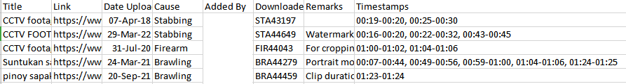

# VGAN-Model

This is the official documentation of the VGAN Model, a Generative Adversarial Networks Model specialized in detecting violence from videos. 

To access the full codebase and dataset used for the model, please contact ccs@uic.edu.ph.

## Data Collection

The gathered videos for the Philippine Violence Dataset is stored in a .csv file. There, each videos are named uniquely.

## Data Annotation

The gathered videos are then annotated, identifying moments of violence in each videos by marking timestamps.



Each video should have their unique identifier and their annotated scenes. These scenes are identified through the timestamps encoded by third-party validators.

### Video Trimming

After annotating the videos, trimming is done in order to create individual clips of violent and non-violent scenes.

```python
os.system("ffmpeg -i " + parent_dir + filename + "/" + filename + ".mp4" + " -ss 00:" + start + " -to 00:" + end + " -c:v libx264 -c:a aac " + parent_dir + filename + "/" + filename + "_" + str(count) + ".mp4")
```

Using the annotation (csv file) as reference, we can use FFMPEG to extract individual scenes from the videos.

## Frame Extraction

Taking the trimmed videos, frame extraction is done to collect individual images and frames.

```python
os.system("ffmpeg -i " + parent_dir + root_name + "/" + filename + " -vf \"select=not(mod(n\," + str(interval) + "))\" -vsync vfr " + new_folder + "/" + mod_string + "_%03d.png")
```

## Numpy Creation

After taking the images, they are converted into data that is compiled into a numpy array.

```python
img_array = Image.open(os.path.join(root_dir[i], file_frames, img))
img_array=img_array.resize((IMG_WIDTH,IMG_HEIGHT))
training_data.append(asarray(img_array))
```

This is done by converting each images into an array data and then appending it into a single numpy array.

## Model Training

With the data ready, generator and discriminator models are trained.

## Model Testing

The models are then tested and the results are noted. With this information, performance of each model trained into their respective data are gauged.

___________

Made with ❤️ by Khyle Montebon
